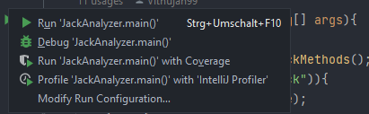
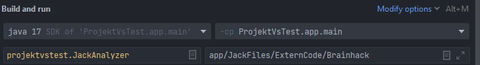

# Jack-Compiler

## Projektbeschreibung

Der **Jack-Compiler** übersetzt Programme, die in der Jack-Sprache geschrieben sind, in die Jasmin-Sprache. Dies ermöglicht die anschließende Umwandlung in Java-Klassen-Dateien (class files), die auf der Java Virtual Machine (JVM) ausgeführt werden können.

## Installation

Um den Compiler auszuführen, muss der Dateipfad zu den Jack-Dateien angegeben werden. Der Compiler erstellt daraufhin Jasmin-Dateien, die in class Dateien umgewandelt werden müssen, um diese auszuführen.

### Schritte zur Installation:

1. **Klonen des Repositories:**
   ```sh
   git clone https://github.com/dein-benutzername/Jack-Compiler.git
   cd Jack-Compiler
2. **Ausführen des Compilers:**
   Vor dem Ausführen des Compilers, müssen Sie den Dateipfad angeben:

   - Öffnen Sie Ihre Entwicklungsumgebung (IDE).
   - Gehen Sie zu "Run" > "Edit Configurations".
   - Erstellen Sie eine neue Run-Konfiguration für den Jack-Compiler.
   - Geben Sie den Pfad zu den Jack-Dateien als Program Argument ein.

   Beispiel in IntelliJ IDEA:
   
   

3. **Umwandeln der Jasmin-Dateien in class Dateien:**

   Dafür benötigen Sie die Jasmin.jar Datei, die Sie [hier herunterladen können](https://jasmin.sourceforge.net/).

   Um die Jasmin-Dateien in class Dateien umzuwandeln, führen Sie folgenden Befehl aus:
   ```sh
   java -jar Jasmin.jar /pfad/zu/deinen/jasminfiles